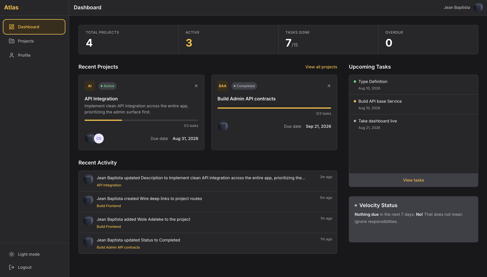
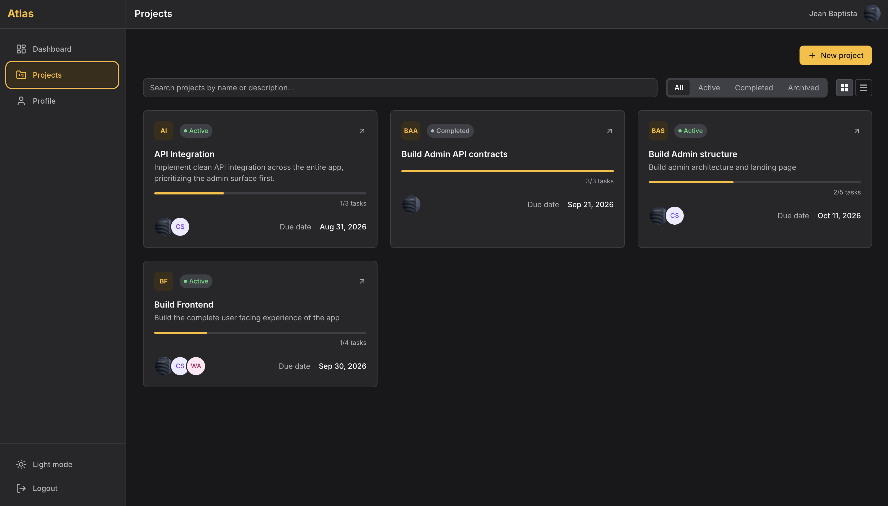

# Atlas

A project management dashboard built on Next.js 16 and Supabase, with real
row-level security, an audit trail driven entirely by database triggers, and
accessibility treated as a first-class requirement, not an afterthought.

Live demo: https://atlas-murex-nine.vercel.app

[](https://github.com/Fahleh/Atlas/actions/workflows/ci.yml)
[](LICENSE)

## Screenshots

**Dashboard**



**Project view**



## Tech stack

**Frontend**
- Next.js 16 (App Router), `^16.2.6`
- React 19.2.4
- TypeScript, strict mode
- Tailwind CSS 4 + CSS Modules
- TanStack React Query 5, `^5.101.0`
- lucide-react, `^1.16.0`

**Backend and data**
- Supabase: PostgreSQL, Auth, Storage
- `@supabase/ssr`, `^0.10.3`
- `@supabase/supabase-js`, `^2.107.0`

**Testing**
- Jest `^30.4.2` with `ts-jest` and `@testing-library/react`
- Playwright `^1.62.1` for E2E
- MSW `^2.15.0` for Server Action test mocking

**CI and performance**
- GitHub Actions
- Lighthouse `^12.8.2` and `@lhci/cli` `^0.15.1` for a real performance budget gate

## Key features

- Project and task CRUD with status tracking
- Project membership: add and remove collaborators by email, owner/collaborator roles
- Dashboard with recent projects, upcoming tasks, a velocity indicator, and a recent activity feed
- Append-only activity log, written entirely by database triggers, never by application code
- Row-level security scoping every table to a user's actual project membership
- Avatar upload with Supabase Storage
- Light and dark theme, no flash of wrong theme on load
- Accessible modals and dropdowns: focus trapping, live regions, keyboard navigation

## Notable engineering decisions

A curated selection. Full reasoning for each, and everything else, lives in
[docs/decisions.md](docs/decisions.md).

- **Cross-user React Query cache leak, fixed at the layout boundary.** `onAuthStateChange` alone couldn't reliably catch a server-side login or logout, so the fix scopes `QueryProvider` itself to the dashboard layout rather than patching the symptom with an imperative cache clear. See [Scoping `QueryProvider`](docs/decisions.md#scoping-queryprovider-to-appdashboardlayouttsx-deleting-clearquerycacheonmounttsx).
- **Distinguishing an expired session from a legitimate permission denial.** A raw Postgrest `42501` doesn't tell you which one happened, so failed writes call `getClaims()` to tell them apart before showing the user anything. See [Distinguishing sessionExpired from forbidden](docs/decisions.md#distinguishing-sessionexpired-from-forbidden-on-failed-postgrest-writes).
- **A hydration mismatch traced to `localStorage`, not React itself.** The theme toggle used to read directly from `localStorage` during the first client render, disagreeing with the server-rendered HTML. Fixed with `useSyncExternalStore` instead of a `mounted` flag that would have hidden the mismatch rather than removed it. See [Theme toggle via useSyncExternalStore](docs/decisions.md#theme-toggle-reads-via-usesyncexternalstore-not-themecontexts-own-state).
- **A performance budget built from Lighthouse's own scoring thresholds, not arbitrary numbers.** Desktop and mobile are gated separately, off real measured data, with an explicit regression floor for a known, unresolved hydration cost rather than pretending the app is faster than it is. See [CI performance gate](docs/decisions.md#ci-performance-gate-lab-proxies-form-factor-split-thresholds-and-the-file-count-guard).
- **A Trusted Types policy that had to be widened after a real production break.** Vercel's build adapter emits an `immutable/` path segment that a local production build never does, which broke login on the deployed app until the validator's pattern was confirmed against the real deployed HTML and widened to match. See [Trusted Types createScriptURL](docs/decisions.md#trusted-types-createscripturl-default-policy-design-and-the-nextjs-163-immutable-assets-update).

## Testing strategy

- 30 unit test files (`tests/unit/`): pure utilities, error interpretation, and component behavior.
- 15 integration test files (`tests/integration/`): Server Actions and React Query hooks against mocked Supabase responses via MSW.
- 9 Playwright E2E spec files (`tests/e2e/`): full flows including login, signup, project and task CRUD, membership, cross-user data isolation, and an authorization boundary check confirming a collaborator cannot remove a member even by calling the API directly, run against a local Supabase stack.
- CI runs the unit and integration suite (`npm test`) on every pull request to develop & main, required to merge.
- E2E runs in CI but is **not yet a required check**. It needs to clear 10 consecutive non-blocking CI runs across at least a week with zero infrastructure-caused failures before it gates merges, a bar it hasn't cleared yet. Full reasoning in [docs/decisions.md](docs/decisions.md#ci-performance-gate-lab-proxies-form-factor-split-thresholds-and-the-file-count-guard).
- A Lighthouse-based performance budget also runs in CI, required, split by desktop and mobile thresholds.

## Local setup

Requires Node 24, see `.nvmrc`.

```bash
git clone https://github.com/Fahleh/Atlas.git
cd Atlas
npm install
```

Create `.env.local` with your own Supabase project's values:

```
NEXT_PUBLIC_SUPABASE_URL=your-supabase-url
NEXT_PUBLIC_SUPABASE_PUBLISHABLE_KEY=your-publishable-key
```

See `.env.example` for the complete list.

Then:

```bash
npm run dev
```

Other scripts, taken directly from `package.json`:

```bash
npm run build      # production build
npm run start      # run the production build
npm run lint        # eslint
npm test            # jest, unit and integration suites
npm run test:watch  # jest in watch mode
npm run test:e2e    # playwright, requires a local Supabase stack via the CLI (Docker)
```

## Further reading

- [docs/architecture.md](docs/architecture.md), folder structure, state management, data fetching patterns
- [docs/decisions.md](docs/decisions.md), the full set of architectural decisions and the reasoning behind them

## License

MIT, see [LICENSE](LICENSE).
